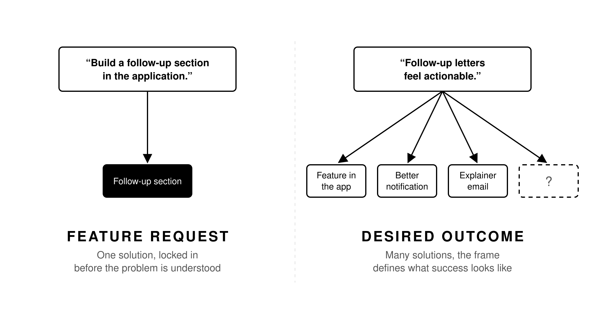
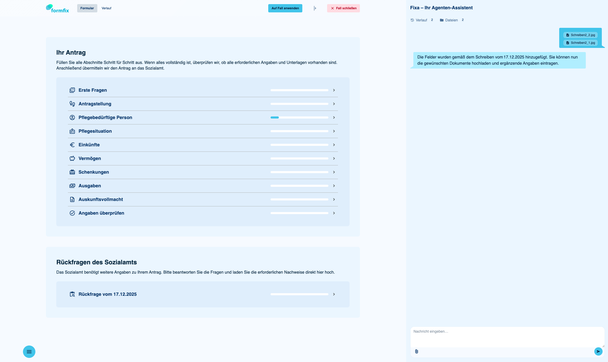

"We need to build a follow-up feature for the letters the relatives get from the social welfare office." That is a feature request. It could have been a real one at [myo](https://myo.de). Except that we do not have feature requests like this. A feature request tells you what to build, but not what problem you are solving. And if you start [shaping]() from a feature request, you have already locked yourself into a solution before you understood the problem.

## A Concrete Example

At [myo](https://myo.de), we build a tool that helps relatives of care home residents apply for social insurance coverage. Until an application is approved, the care home waits for their money. This can take 12 to 18 months. So faster applications mean faster payments, less interest cost, and better cashflow for the care home.

One problem we identified: social authorities often send follow-up letters with additional requests. These letters overwhelm the relatives. They thought the application was done. Now there is a list of things they still need to provide, and they do not know where to start.

The feature request would be: "Build a follow-up section in the application." But that is already a solution. The desired outcome we framed was this:

> Follow-up letters no longer trigger uncertainty or frustration. They feel actionable. Relatives understand that follow-ups are normal and know what is concretely required.

And then, separately, an outcome for the operational side:

> Concierges and care homes have better visibility into the status of an application during the review phase.

And one for the company:

> We have structured input for large quantities of feedback letters, so we can use this data to improve our forms.

## Why This Distinction Matters

If I had framed it as "build a follow-up feature," the team would have started shaping a feature. They would have designed screens, figured out the data model, built the thing. And it might have been the wrong thing.

By framing it as an outcome, the team has room to find the right solution. Maybe it is a feature in the application. Maybe it is a better notification. Maybe it is a simple explainer email. Maybe it is all three. The frame does not prescribe the solution. It defines what success looks like.

This also makes the frame useful as an acceptance check throughout the process. During shaping, you can ask: does this solution make follow-ups feel actionable? During delivery, you can ask: will this implementation reduce the frustration? After shipping, you can measure: did the number of reassurance calls go down?

## The "Solution in Disguise" Trap

[Teresa Torres](https://www.producttalk.org/) calls feature requests that hide a solution "solutions in disguise" in her opportunity mapping framework. And Donald Gause and Gerald Weinberg wrote in [*Are Your Lights On?*](): "Don't mistake a solution method for a problem definition."

> "So much complexity in software comes from trying to make one thing do two things."
> ([Ryan Singer](https://www.ryansinger.co/), Shape Up)

Every time someone frames a request as "we need X," check if X is already a solution. Ask: what will change for the user when X is done? What problem does the user have today that will no longer exist?  
Frame that.  
Not X.

## How to Frame Outcomes

In my [framing](https://www.ryansinger.co/framing/) template, I use two sections:

**Strategic context.** Who is experiencing the problem? How much do they or we care? Why is this relevant right now? What is the current workaround? How often does it happen?

**Desired outcome.** What will be better in the future? What does success look like? What KPIs does it drive? All of this without specifying the solution.

[Marty Cagan](https://www.svpg.com/) makes the same distinction in *Inspired*: "Fall in love with the problem, not the solution." And: "Products equal outcomes, projects equal output."

The frame should be a small, strong nugget. Not a PRD. Not a long document. Three to five bullet points for each of the two sections, never more. They capture the essence of the problem and the desired future state. Something that survives the stages ahead and keeps everyone anchored on what matters.

## What We Ended Up Building

The obvious solution would have been a form builder, so our case managers can click together a follow-up form by hand for every letter. In the end, it was neither a follow-up section nor a form builder. It became an agent that lets our case managers attach the follow-up letters from the authorities. Nobody would have written that into a feature request. It came out of the outcome, together with the creative minds on my team.
