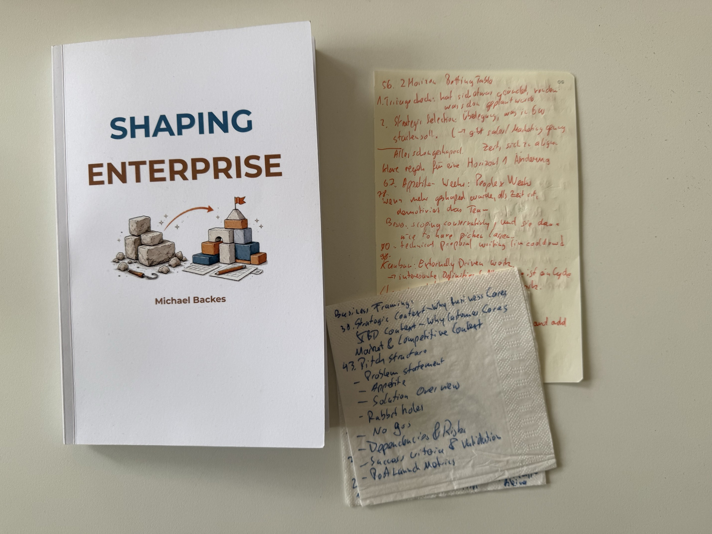

My notes on this book fit on two napkins and two notebook pages. That says something about the book, in both directions.

There is a new Shape Up book, and it is written by a practitioner. [Shaping Enterprise](https://amzn.to/4x82oHv) by [Michael Backes](https://www.linkedin.com/in/michaelbackes/) is a field guide for running Shape Up in B2B product organisations. That is exactly the gap I care about. The original [Shape Up]() was written for a small, opinionated, product-led company. Most of us run it in places with sales teams, enterprise customers, delivery commitments and dependencies between teams. A book about that was overdue.

## First, the honest part

Honest verdict: a lot of very good, applicable advice, but it also reads like a lot of it was written with AI. It could have been a little bit shorter, and I would have loved it even more without the generic filler.

But nevertheless I really like the advice and applied some of it already to my product operating model at [myo](https://myo.de). I am super happy that we have another Shape Up book, one that covers a field the original left uncovered. So here is the part I kept, in a nutshell.

## Roadmap, betting table, cycles: three layers, three questions

The most useful structure in the book is the separation into three layers:

- **Thematic roadmap**: the what and why. Strategic direction, problems to solve.
- **Betting table**: which of these now.
- **Cycles**: the how.

The point that stuck with me: a thematic roadmap is not a list of commitments with a delivery schedule. The book differentiates between thematic roadmaps (we are focusing on this problem this quarter) and delivery commitments (we are delivering this by then, once the work is more concrete and shaped).

That is the classical problem versus solution differentiation, like in framing and shaping. I love it.

A nice side effect is what it does to sales. If sales talks about customer problems, and they know which problems the product organisation tackles next, they can sell direction without selling dates.

## The quarter is two cycles plus two weeks

Instead of six weeks plus two weeks of cooldown, the book proposes a quarter as two cycles of four weeks and two weeks of cooldown. That fits the quarterly rhythm most B2B companies already run on.

More important than the exact numbers is the rule behind it: **appetite beats the timebox**. If something does not fit, you have two options, and both are explicit:

1. Sacrifice the cooldown.
2. Make the appetite smaller and keep a buffer.

What you do not do is quietly let the cycle grow.

## Appetite is people times weeks

The book measures appetite in people times weeks, not in weeks alone. Two people for four weeks is a different bet than four people for four weeks, and the betting table should see that difference.

There is a second point on scoping that I wrote down twice: if more was shaped than fits the time, the team gets demotivated. It is better to scope conservatively and let the team pick the nice-to-haves themselves. Shaping conservatively is not a lack of ambition. It is how you keep the team in control of the scope.

## The enterprise pitch

The Shape Up pitch gets an extension for organisations that need to justify a bet to more than a founder. The pitch is wrapped in a business framing that qualifies the bet before anyone reads the solution:

- **Summary**: revenue potential, cost savings, effort in people and weeks, strategic value, risk level or confidence, ROI.
- **Marketing blurb**: how you would announce it.
- **Business framing**: why now. Strategic context (why the business cares), jobs-to-be-done context (why customers care), market and competitive context.

## Two horizons on the betting table

This is the idea I will use most. The betting table works in two horizons:

1. **Triage check**: has anything changed about what was already planned and is running now?
2. **Strategic selection**: what starts in six weeks?

Everything that enters horizon two is already shaped. Deciding six weeks ahead gives sales and marketing enough time to align, prepare launches, and talk to customers. In a B2B organisation this is the difference between a product team that ships and a company that launches.

The catch: to work in this mode you need clear rules for changing horizon one. If anyone can pull the current cycle around, the second horizon is worthless.

## Kanban is externally driven work

The book gives the cleanest definition I have read for the two-process question. **Kanban is externally driven work. Shape Up is internally controlled work.** Everything that comes in from outside, from support, from customers, from legal, runs on a board. Everything the company decides to invest in runs in cycles.

People are shared across both processes. The processes are not mixed. That is the setup I recommend as well, and it is good to see the same conclusion from another practitioner.

## Dependencies and things that do not fit

Three rules for dependencies between teams:

- Assume the dependency will slip and add a buffer to the pitch.
- Synchronize the betting tables of the teams involved.
- Accept that some cycles will fail because of it.

And for work that does not fit into six weeks: forcing it into cycles is the mistake. Run it outside the cycle system, with an explicit number of people and an explicit appetite, and keep it visible on the betting table.

Technical proposal writing, by the way, belongs in the cooldown. That is when engineers have the head space to shape the technical side of the next bets.

## It is a cultural change, not a process change

Two lines I underlined:

- Shape Up is not a process change. It is a cultural change.
- Shaping does not mean avoiding spec details. It means deciding which details matter at this altitude.

And the common mistakes in the first ninety days:

- Rolling out too fast.
- Doing it dogmatically.
- Skipping the roadmap work.
- Under-investing in shaping.
- Not protecting the boundaries.

The first ninety days are not about running perfect cycles. They are about shaping better, so that the fitting work ends up in the cycle instead of being left over at the end.

## Should you read it?

If you run Shape Up in a B2B organisation, yes, with a pencil and permission to skim. The two-horizon betting table, the enterprise pitch structure, the people times weeks appetite and the Kanban definition are worth the price alone.

Often I read books simply to reflect on my own situation. Strategic challenge? Read a standard work on strategy like [Good Strategy Bad Strategy](). New leadership role? Back to the basics with [Become a Great Engineering Leader](). Shape Up in an enterprise context? This one does that job.

If you are new to Shape Up, read the original first. This book assumes you already know why you are shaping.
