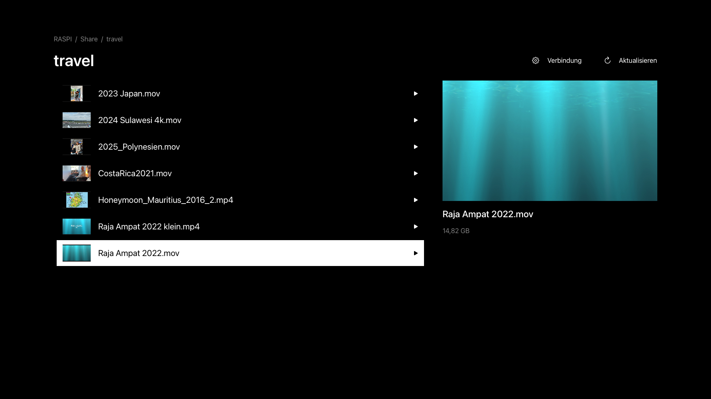

Our travel videos live on a Raspberry Pi in the hallway. One Samba share, one folder per trip: [Costa Rica](), [Japan](), [Sulawesi](), [Polynesia](), [Raja Ampat]().

I wanted to watch them on the couch. So I built an Apple TV app.

## Why?

Every app I tried was either annoyingly complicated or wanted yet another server.

Complicated, because the same app also serves five other use cases: a movie library with cover art from the internet, subtitles, a music player, cloud storage, playlists. Getting to my one folder took more clicks than watching the video.

Another server, because Plex, Jellyfin and friends want a daemon on the Pi or the NAS that indexes, transcodes and updates itself. I do not want to run a media server. I have a folder.

And the big files. The Raja Ampat cut is 15 GB. It either did not start at all, or it stuttered every few seconds.

So I did what I had done with [Texttile]() a few weeks earlier. I built the small thing myself. It is called SMB Olek. Say it out loud: Samba Olek. I hope you get the joke.

## What it does

Pick a network device, open a share, open a folder, play a video. That is the whole app.

- The Apple TV finds SMB servers in the local network via Bonjour. If yours does not announce itself, you enter host and share by hand.
- Shares and subfolders are browsed directly. Folders without videos disappear once they are fully scanned. Backups and AppleDouble clutter stay hidden.
- Every video gets a thumbnail, rendered from a frame of the file itself. Nothing is fetched from the internet.
- Playback streams byte ranges straight from the share. No copying, no waiting for a download. Seeking jumps to the byte offset and continues from there, also beyond 4 GiB.
- The remote does what you expect: play and pause, ten seconds left and right, back closes the video. The controls fade out after four seconds.
- Passwords go into the Keychain. The app never writes to the share.

## What it is not

No media library. No cover art from the internet. No metadata scraping. No server on the Pi. No account, no analytics, no ads. The interface is black and white and shows your folder names, nothing else.

I built it for one couch and one folder (though it supports multiple). A product is done when there is nothing left to take away.

## Why native

Swift and SwiftUI, two decoders behind one player. AVFoundation handles HEVC and H.264 with hardware decoding. When it cannot read a format, ProRes for example, the app switches to VLC's decoder (TVVLCKit) and the same file plays. The thumbnails fall back the same way.

The SMB part is libsmb2 with a thin Swift wrapper and one patch. Unpatched libsmb2 fails on guest sessions over SMB 3.1.1, because it signs the tree connect without a session key. The patch reads the guest flags the server sends. It does not loosen signing or encryption requirements. If the server demands them for a guest, the connection is refused, as it should be. SMB 2.0.2 through 3.1.1 are tested against the Pi.

And the 15 GB file? Plays, seeks, keeps playing.

## Try it

[SMB Olek is in the App Store](https://apps.apple.com/de/app/id6809174802). 12.99 EUR once, no subscription.

You need an SMB 2 or SMB 3 share with your own videos. The app brings no films and needs no account. For protected shares you use the credentials of your server.

How do your videos get from the NAS to the TV?
