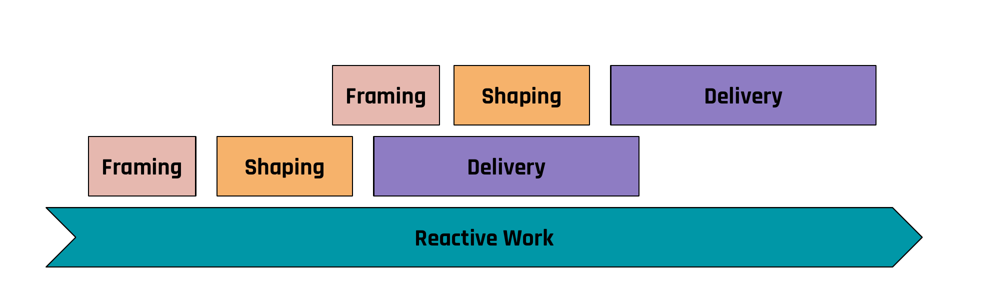

One of the most common questions I get when introducing Shape Up: "What about bugs? What about urgent requests? What about the legal thing that just came in?"

The answer is simple: you need two parallel processes. Shape Up for the big bets. Kanban for the baseline work.

## Why You Cannot Put Everything in Cycles

If you try to run all your work through shaped cycles, one of two things happens. Either you interrupt your cycles constantly for bugs and urgent requests, which defeats the purpose of the fixed timebox. Or you ignore the bugs and urgent requests, which is not realistic in any production environment.

You need slack in the system. Not Slack the tool, slack as in spare capacity. People who are not inside a cycle, who can handle the reactive work that every software product generates.

## How I Run It

In my team of about 10 people, we always have people inside a cycle (working on a shaped, timeboxed problem) and people outside the cycle (handling bugs, support escalations, small improvements, infrastructure work).

David Heinemeier Hansson describes a similar setup at Basecamp: reactive work runs as a separate concern alongside project work. The people outside the cycle operate in Kanban style. We refine our reactive work once a week. No framing, no shaping, no appetite discussions. Just triage, prioritize, and work through the queue.

This is not second-class work. It is essential. Someone needs to keep the system running, fix the things that break, and handle the requests that cannot wait six weeks.

## The Optimization Trap

The temptation is to put everyone into cycles. It feels more productive. It feels more strategic. But it is a trap.

Will Larson puts it simply in *An Elegant Puzzle*: "Innovating requires slack." If all your resources are in cycles, you have zero capacity for the unexpected. And in software, the unexpected is not the exception. It is the baseline. A critical bug will come. A legal requirement will come. A customer escalation will come.

If the only people who can handle it are inside a cycle, you have to pull them out. Now the cycle is disrupted. The team loses focus. The appetite might not be enough anymore. You have optimized for the plan and broken the execution.

## The Balance

There is no universal ratio. It depends on the maturity of your product, the stability of your codebase, and the volume of reactive work. In some phases, you might have half your team in cycles and half on Kanban. In others, you might run two cycles in parallel with just one or two people on reactive duty.

The key insight is that you plan for this explicitly. It is not a failure to have people outside of cycles. It is a design choice. You deliberately allocate resources to keep the system healthy while investing in the big improvements.

## What Goes Where

**Shape Up cycles** are for problems that need two to three people for two to six weeks. Problems that are worth the overhead of framing and shaping. Problems where you want to invest deliberately and deliver something meaningful.

**Kanban** is for everything else. Bug fixes, small improvements, infrastructure tasks, support requests, compliance items. Things that are important but do not justify the framing and shaping overhead. Things that need to happen on a flexible timeline.

One catch, though: if you run your Kanban without strict WIP limits, you end up with exactly the mess that Shape Up is designed to prevent. An ever-growing backlog of "someday" items that nobody triages, nobody prioritizes, and nobody deletes. That backlog becomes a graveyard of good intentions, and every refinement session turns into an archaeological dig.

Enforce WIP limits ruthlessly. If the board is full, something has to leave before something new enters. This is not optional. Without it, your Kanban side becomes a dumping ground, and chaos on the operational side undermines the clarity you gained from Shape Up on the strategic side.

The two processes complement each other. Shape Up gives you focus and predictability on the big bets. Kanban gives you flexibility and responsiveness on the daily realities. But only if you keep both sides clean. Trying to force everything into one system is where teams get stuck. And letting one side rot while you optimize the other is just as bad.
