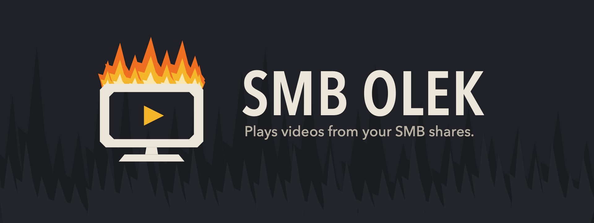
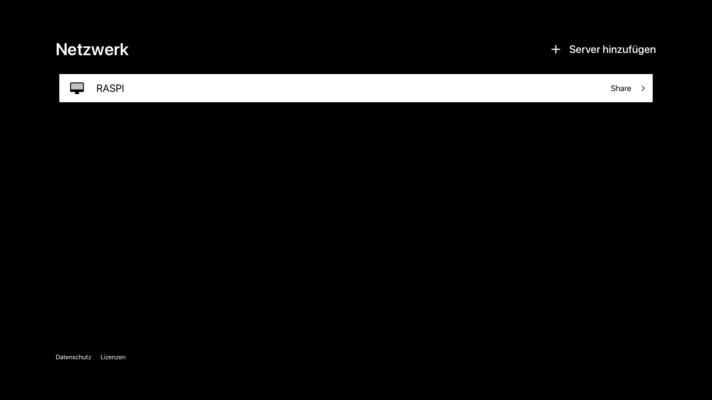
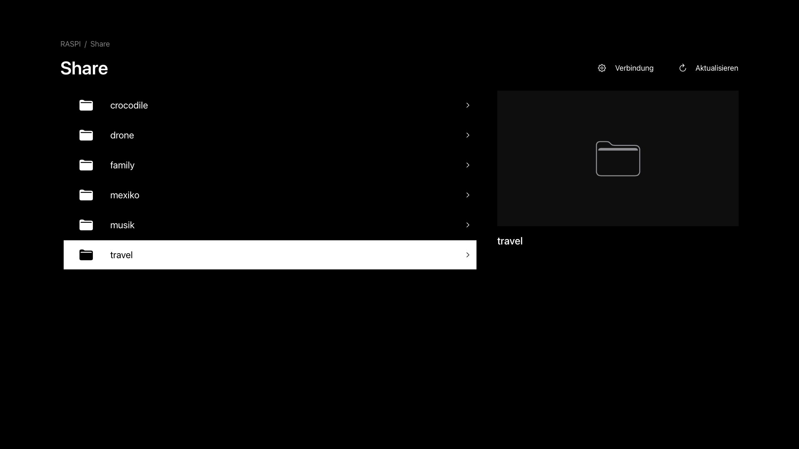
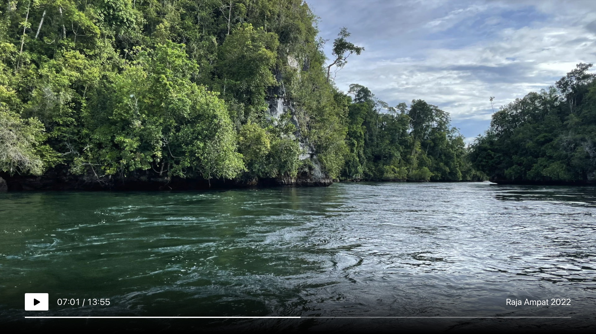

Unsere Reisevideos liegen auf einem Raspberry Pi im Flur. Eine Samba-Freigabe, ein Ordner pro Reise: Costa Rica, Japan, Sulawesi, [Polynesien](), Raja Ampat. Manche dieser Dateien sind groß. Der Raja-Ampat-Schnitt hat 15 GB.

Ich wollte nichts weiter, als auf der Couch zu sitzen und sie auf dem Apple TV abzuspielen.

## Alles andere kann zu viel oder braucht zu viel

Ich habe die Apps ausprobiert, die es gibt. Sie zerfallen in zwei Gruppen.

Die erste Gruppe ist nervig kompliziert, weil dieselbe App nebenbei fünf andere Use Cases bedient: eine Filmmediathek mit Covern aus dem Internet, Untertitel, einen Musikplayer, Cloud-Speicher, Playlists. Bis zu meinem einen Ordner waren es mehr Klicks als das Video lang ist.

Die zweite Gruppe braucht noch einen Server. Plex, Jellyfin und Co. wollen einen Daemon auf dem Pi oder dem NAS, der indexiert, transkodiert und sich selbst aktualisiert. Ich will keinen Medienserver betreiben. Ich habe einen Ordner.

Und beide Gruppen taten sich mit den großen Dateien schwer. Die 15-GB-Datei lief entweder gar nicht an, oder sie lief an und ruckelte alle paar Sekunden.

Also habe ich getan, was ich ein paar Wochen zuvor mit [Texttile]() getan hatte. Ich habe das kleine Ding selbst gebaut.

## Was SMB Olek macht

Gerät auswählen, Freigabe öffnen, Ordner öffnen, Video abspielen. Das ist die ganze App.

- Der Apple TV findet SMB-Server im lokalen Netzwerk per Bonjour. Wenn deiner sich nicht meldet, trägst du Host und Freigabe von Hand ein.
- Freigaben und Unterordner werden direkt durchsucht. Ordner ohne Videos verschwinden, sobald sie vollständig gescannt sind. Backups und AppleDouble-Kram bleiben verborgen.
- Jedes Video bekommt ein Vorschaubild, gerendert aus einem Frame der Datei selbst. Nichts wird aus dem Internet geladen.
- Die Wiedergabe streamt Bytebereiche direkt von der Freigabe. Kein Kopieren, kein Warten auf einen Download. Spulen springt zum Byte-Offset und läuft von dort weiter, auch jenseits der 4-GiB-Marke.
- Die Fernbedienung tut, was man erwartet: Play und Pause, zehn Sekunden links und rechts, Zurück schließt das Video. Die Steuerung blendet sich nach vier Sekunden aus.
- Kennwörter landen im Schlüsselbund. Die App schreibt nie auf die Freigabe.

## Was es nicht ist

Keine Mediathek. Keine Cover aus dem Internet. Kein Metadaten-Scraping. Kein Server auf dem Pi. Kein Konto, keine Analytics, keine Werbung. Die Oberfläche ist schwarz und weiß und zeigt deine Ordnernamen, sonst nichts.

Ich habe es für eine Couch und einen Ordner gebaut. Und ich finde weiterhin, dass ein Produkt erst fertig ist, wenn man nichts mehr wegnehmen kann.

## Warum nativ

Die App ist Swift und SwiftUI mit zwei Decodern hinter einem Player. AVFoundation übernimmt HEVC und H.264 mit Hardware-Decoding. Wenn AVFoundation ein Format nicht lesen kann, ProRes zum Beispiel, wechselt die App auf den Decoder von VLC (TVVLCKit), und dieselbe Datei läuft. Die Vorschaubilder fallen genauso zurück.

Der SMB-Teil ist libsmb2 mit einem dünnen Swift-Wrapper und einem Patch. Unverändertes libsmb2 scheitert bei Gastsitzungen über SMB 3.1.1, weil es den Tree Connect ohne Sitzungsschlüssel signiert. Der Patch liest die Gast-Flags aus, die der Server schickt. Er lockert keine Anforderungen an Signierung oder Verschlüsselung. Verlangt der Server sie für einen Gast, wird die Verbindung abgelehnt, so wie es sein soll. SMB 2.0.2 bis 3.1.1 sind gegen den Pi getestet.

Und die 15-GB-Datei? Spielt, spult und läuft weiter.

## Probier es aus

SMB Olek ist eine bezahlte App, 12,99 Euro einmalig, kein Abo. Version 1.0 ist zu App Store Connect hochgeladen und wartet auf das Review. Der Link kommt hierher, sobald sie live ist. Die Oberfläche ist vorerst Deutsch.

Du brauchst eine SMB-2- oder SMB-3-Freigabe mit eigenen Videos. Die App bringt keine Filme mit und braucht kein Konto. Für geschützte Freigaben nutzt du die Zugangsdaten deines Servers.

Mich interessiert: Wie kommen deine Videos vom NAS auf den Fernseher?
