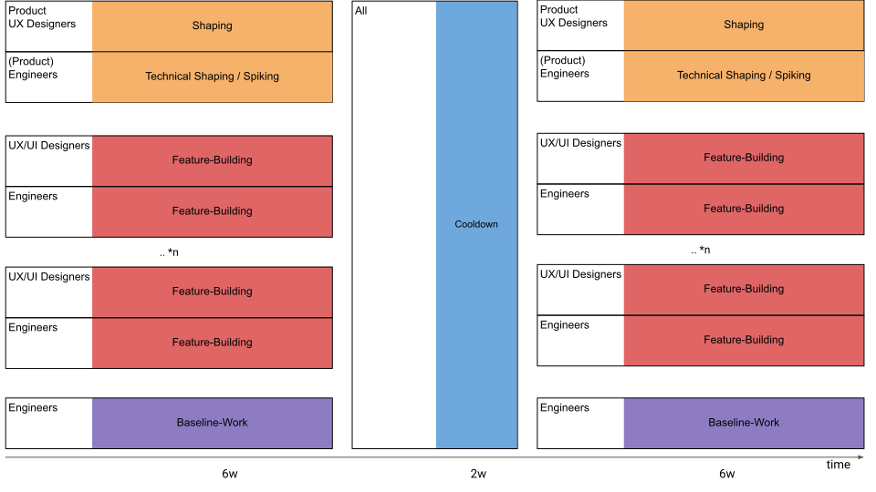
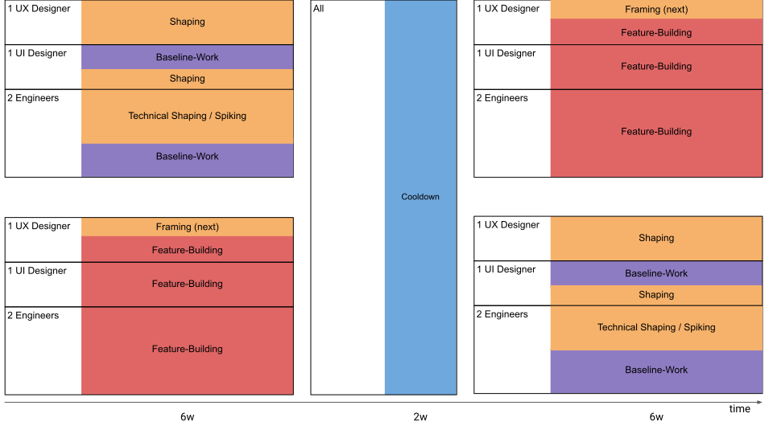
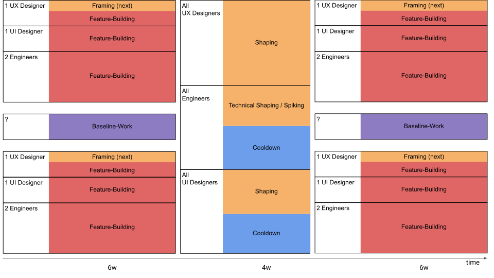

One thing that should be discussed more in detail in Shape up is how to implement it for smaller teams, like migrating an unhappy Scrum team. Many of the cases addressed publicly are for the entire company. But with the correct pattern, even smaller teams can benefit from the principles of [appetite](https://basecamp.com/shapeup/1.2-chapter-03#setting-the-appetite) and [small, autonomous teams](https://basecamp.com/shapeup/0.3-chapter-01#making-teams-responsible).

A single scrum team is a smaller unit than an entire company; however, for many companies migrating to Shape Up, it could be an excellent first step to experiment and create advocates. ([I did so by myself - read this article, why it makes sense to migrate from Scrum to Shape Up in the first place.](../20220923shape-up-track-for-scrum-or-how-to-experiment-with-the-process))

Compared to larger, company-wide setups, small teams have one key difference: each developer knows the entire codebase well. And the overall codebase is small enough, in most cases, for everybody to work on everything. So everyone can help with technical shaping and try things out. (Nevertheless, continuous integration/deployment and feature flags are necessary, even for small teams to work with Shape Up so that everyone can work on different features in parallel)
  <!-- wp:html --> .wp-image-3099 {display:none !important;} <!-- /wp:html --> ## Setting
But let's get specific. In this particular case, we have this team setup:

- 4 (Fullstack) Engineers
-  2 UX Designer
-  2 UI Designer
-  1 Product Owner (previously called this)

It is important to note that the Product Owner in this specific case was more of a management role with other responsibilities than a hands-on conceptional Product Manager. So much of the strategic/conceptual work falls to UX.

Furthermore, there is one more aspect that makes the roles of UX in the real world (as compared to 37signals) even more special:

- At 37signals, it seems that no specialized person or separate trade is responsible for the user experience. On the one side, there is a lot of UX knowledge during shaping from their CEO, [Jason](https://world.hey.com/jason), and their Strategist, [Ryan](https://feltpresence.com/) (back then). But according to their podcasts, the (Product) Designers also have much UX knowledge when implementing designs during the cycle.
- Outside of 37sSignals, there is often a specialist UX trade, working on the one hand very high level on a product level, but also closely hands-on with UI in the real world.

That makes it difficult to draw a sharp line here. But one thing is sure: UX is relevant for shaping and building.

But also, other roles have other / shared responsibilities at specific points during the timeline.
  ## The Patterns
In the following, I would like to share with you a few patterns that would have been helpful for me when I was new to implementing Shape up.

Color coding:

- Orange: Conceptual/strategic "uphill" work. Lead by experts with product/strategy and UX skills — complemented by engineers who know the codebase and designers with the foresight to participate in shaping and prototyping actively.
- Red represents the "downhill" work to build new features. The designers design, the engineers write the code, and UX / Product gives sparring alongside.
- Purple is for baseline work. For developers, this is customer onboarding, evolving architecture, fixing bugs, and refactoring code. For designers, this is: making sure the visual big-picture of the application is coherent, building the design system, and polishing.
- Blue: Cooldown time between Sprints, [as defined in Shape Up](https://basecamp.com/shapeup/2.2-chapter-08#cool-down). Here the teams are reshuffled, dependent on what the next cycle needs.

What all possible patterns have in common: The implementing (small) team does their work autonomously - as long as possible in a timebox.
  ## Company Wide Shape Up

Shape Up is/will be rolled out company-wide in this situation. With many development teams and enough Slack in the system, there are resources to take care of the baseline.

For the shaping part, this model is based roughly [on what Chris Spiek and Justin Dickow shared](https://www.youtube.com/watch?v=cZF_zV2iby4)when they took Product (minded) Engineers out of their development team and put them into the Product department.

[If the shapers can bring a pitch to the builders at the right altitude](https://basecamp.com/shapeup/1.5-chapter-06), then they are freed up to be already working on framing and shaping the following things during a build cycle.

With a track for baseline work, the rest of the developers are free to focus on actual features without being disturbed.
  ## Scrum Team Migration Pattern A: Flip-flopped Shaping

  

In this alternative approach, a team works divided into 2 parts most of the time.

[With this pattern, I currently migrate a Scrum team (as mentioned above).](../20220923shape-up-track-for-scrum-or-how-to-experiment-with-the-process)

One-half of the team can fully concentrate on building. Depending on the maturity and point in time during the cycle, UX + Product can already start with other obligations, like [framing the following features](https://world.hey.com/rjs/20-framing-2f64ddca).

The other half of the team takes care of the baseline work and keeps the builders free while spending time on (technical) shaping.

Product and UX have 6 weeks to focus on shaping. Enough time to test prototypes with real customers and conduct interviews.

You can run this model with fixed teams or rotate them regularly. To ensure a healthy mix, 2 people from a 4-person team can always change (on average) depending on how the feature needs it.
  ## Scrum-Team Migration Pattern B: Interleaved Shaping

  

Everyone is constantly building or shaping during this entirely different pattern for small teams.

The first thing to notice is that there is no fixed responsibility for the baseline work. The developers inside the cycle need to take care, for example, with fixed days for it ("[Bugfix Mondays](https://www.youtube.com/watch?v=CtcSwlvIIuo)") or on-call rotations.

Considering this exception, all developers and UI designers can concentrate on building.

The cooldown phase is extended and used (partly) for shaping. Also, it is possible to remix the teams at this stage.

Shaping is the absolute focus of the UX and product people during the Cooldown phase. During the cycles, they are sparring partners for the current topic while already framing a couple of upcoming topics.
  ## One more thing: The shaping must have the right attitude.
It doesn't matter if it's a small team or if the whole company is doing Shape Up: The pitch must always have the right altitude.

If the pitch has the right altitude, it will free up the UX and Product resources to do their actual work.

What is the right altitude of a pitch? It comes down to the fact that the team working on it can implement it without clarifying open questions with the shapers (UX / product). [The book is more extensive on this](https://basecamp.com/shapeup/1.1-chapter-02).

Otherwise, this little checklist from my current team might also help:

- Is the pitch de-risked enough from the [demand (user) and supply (tech) side](https://therewiredgroup.com/what-do-we-mean-by-demand-side-and-supply-side/)?
- Are all questions answered - no rabbit holes.
- Backed by actual data and calculations
- Prototypes in the existing codebase
- Maybe user-feedbacked
- Breadboarding and Fat Marker Sketches instead of wireframes.

Note: This is an advanced article about implementing Shape Up. If you don't know the basics of Shape Up yet, [look at my page on Shape Up with the related resources.](../shape-up)

